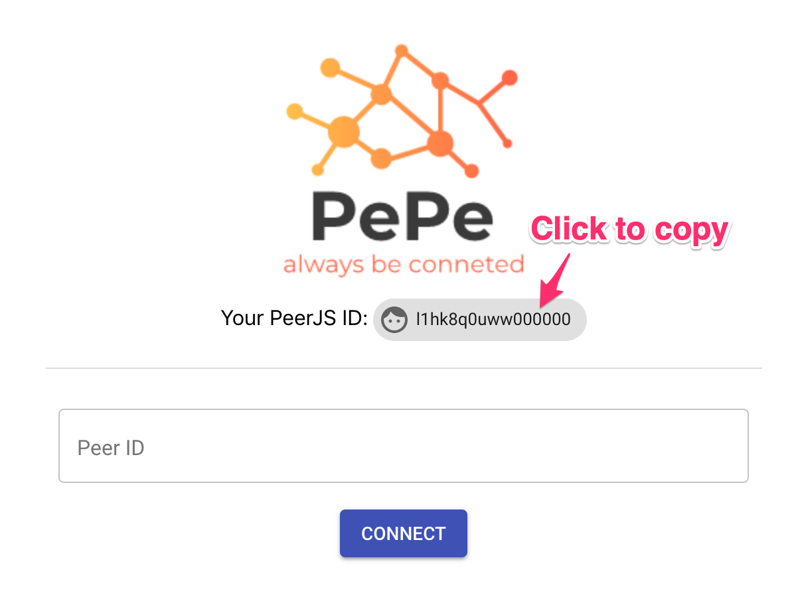
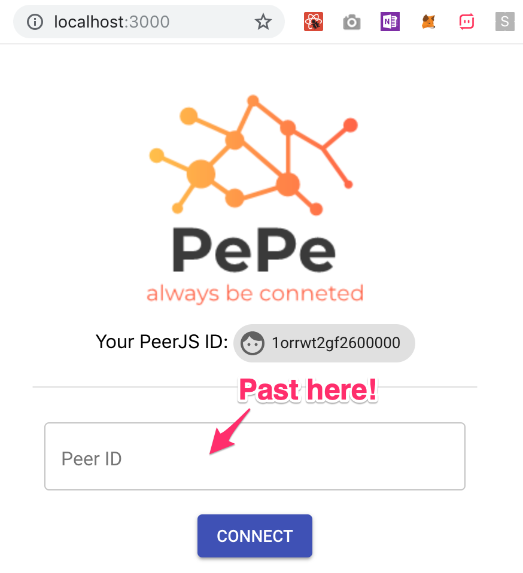
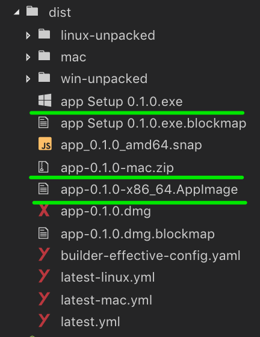

# PePe


**PePe** is an app to play around Peer-To-Peer using [PeerJS](https://peerjs.com/). Also it can be converted to desktop app such as macOS, Windows and Linux.

# Usage

## Development

First, clone this repository to your environment.

Install packages.

```sh
$ yarn
```

Run `yarn electron-dev` then you can see a desktop app is populated.

```
$ yarn electron-dev
```



Click your `PeerJS ID`.

Access `http://localhost:3000` and paste ID you just copied to `Peer ID` input box and click a `CONNECT` button.



If you see a view as below then connection between peers was successful and everything is ready to play.


Send some texts then that will be shown in the peer node also send a file then that will be sent and can be downloaded in the peer node as well.


> NOTICE: Sometimes connection could be failed because I just use test signaling server provided from [PeerJS](https://peerjs.com/).

## Distribution To A Desktop App

If you want to just run `yarn electron-pack`. (Wait for minutes.)

```sh
$ yarn electron-pack

  ...

  • rebuilding native production dependencies platform=win32 arch=x64
  • rebuilding native dependency name=fsevents
  • cannot build optional native dep dep=fsevents
  • packaging       platform=win32 arch=x64 electron=3.0.8 appOutDir=dist/win-unpacked
  • default Electron icon is used reason=application icon is not set
  • building        target=nsis file=dist/app Setup 0.1.0.exe archs=x64 oneClick=true
  • building embedded block map file=dist/app-0.1.0-mac.zip
  • building block map blockMapFile=dist/app Setup 0.1.0.exe.blockmap
✨  Done in 284.98s.
$
```

After finishing build, in `dist` directory you can see binary files for macOS, Linux and Windows.



# Useful Resources

- [From React to an Electron app ready for production](https://medium.com/@kitze/%EF%B8%8F-from-react-to-an-electron-app-ready-for-production-a0468ecb1da3)
- [Build a Peer-to-Peer File Sharing Component in React & PeerJS](https://www.sitepoint.com/file-sharing-component-react/)
- [Peer-to-peer](https://en.wikipedia.org/wiki/Peer-to-peer)
- [PEER JS](https://peerjs.com/docs/)
- [WebRTC](https://en.wikipedia.org/wiki/WebRTC)
- [Web RTC Architecture](https://webrtc.org/architecture/)
- [Material-UI](https://material-ui.com/)
