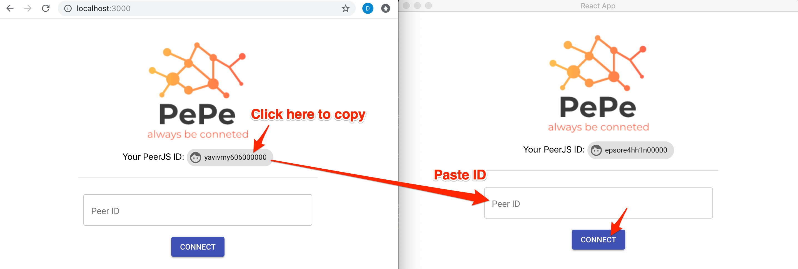
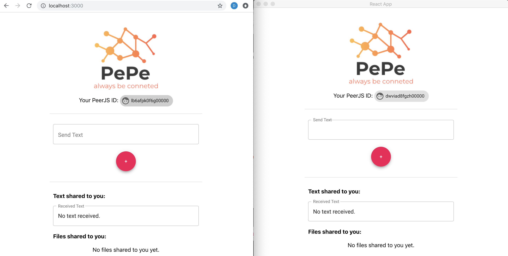

# PePe


**PePe** is an app to play around Peer-To-Peer using [PeerJS](https://peerjs.com/). Also it can be converted to desktop app such as macOS, Windows and Linux.

# Play Demo Online

Open the link as below in **two browser tabs** and
follow [here](https://github.com/daenamkim/pepe#connection-between-apps) to play.

[PePe Demo](https://pe-pe.herokuapp.com/)

# Play On Local Environment

From now on, we are going to do peer-to-peer connection between Web App and Desktop App.

## Setup

First, clone this repository to your environment.

Install packages.

```sh
$ yarn
```

Run `yarn electron-dev` then you can see a desktop app populated and access a web app through the browser.

```
$ yarn electron-dev
```

## Desktop App


## Web App

Access `http://localhost:3000` then you can see as below.


## Connection Between Apps.

OK everything is ready. Let's connect between two apps.

1. Copy a `Your PeerJS ID` from the web app and paste it to `Peer ID` in the desktop app (or vice versa).
2. Click `CONNECT` in the desktop app.

> NOTICE: Sometimes connection fails because each ID has a lifetime limit and code is using a test signaling server provided from [PeerJS](https://peerjs.com/) unstable occasionally. Feel free to run again. :)



3. Connection succeeded then you can see as below then send a text or a file to each peer and download it.



## Distribution To A Desktop App

If you want to distribute this app, just run `yarn electron-pack`. (Wait for minutes.)

```sh
$ yarn electron-pack

  ...

  • rebuilding native production dependencies platform=win32 arch=x64
  • rebuilding native dependency name=fsevents
  • cannot build optional native dep dep=fsevents
  • packaging       platform=win32 arch=x64 electron=3.0.8 appOutDir=dist/win-unpacked
  • default Electron icon is used reason=application icon is not set
  • building        target=nsis file=dist/app Setup 0.1.0.exe archs=x64 oneClick=true
  • building embedded block map file=dist/app-0.1.0-mac.zip
  • building block map blockMapFile=dist/app Setup 0.1.0.exe.blockmap
✨  Done in 284.98s.
$
```

After finishing build, in `dist` directory you can see binary files for macOS, Linux and Windows.


# TODO in the future

- [ ] Multiple connections of peers.
- [ ] Building up a signaling server using Serverless.
- [ ] Automatic getting candidate nodes on running client app.
- [ ] Cool TDD.

# Useful Resources

- [From React to an Electron app ready for production](https://medium.com/@kitze/%EF%B8%8F-from-react-to-an-electron-app-ready-for-production-a0468ecb1da3)
- [Build a Peer-to-Peer File Sharing Component in React & PeerJS](https://www.sitepoint.com/file-sharing-component-react/)
- [Peer-to-peer](https://en.wikipedia.org/wiki/Peer-to-peer)
- [PEER JS](https://peerjs.com/docs/)
- [WebRTC](https://en.wikipedia.org/wiki/WebRTC)
- [Web RTC Architecture](https://webrtc.org/architecture/)
- [Material-UI](https://material-ui.com/)
- [Heroku Node.js Support](https://devcenter.heroku.com/articles/nodejs-support)
